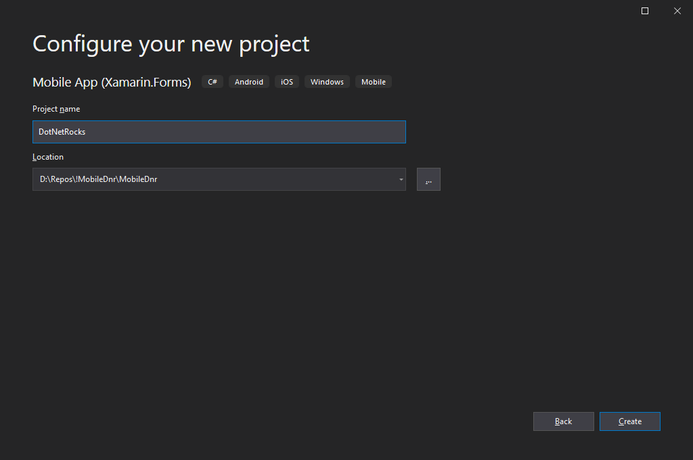
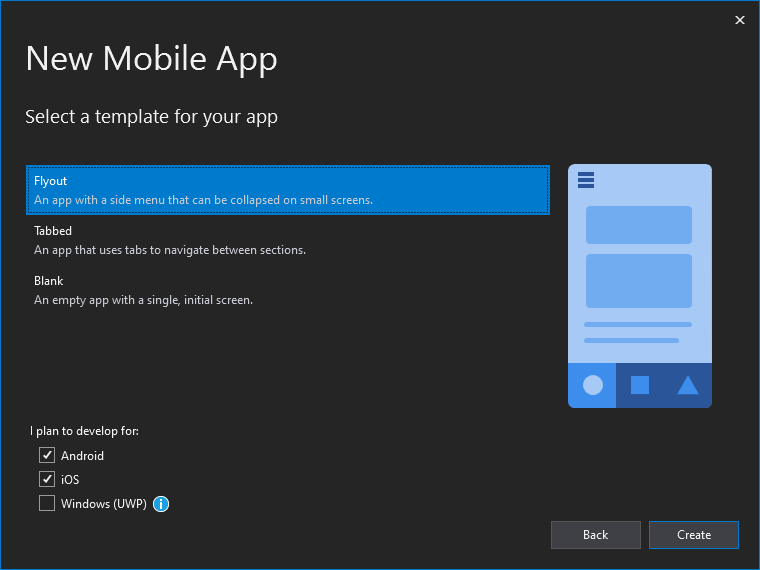
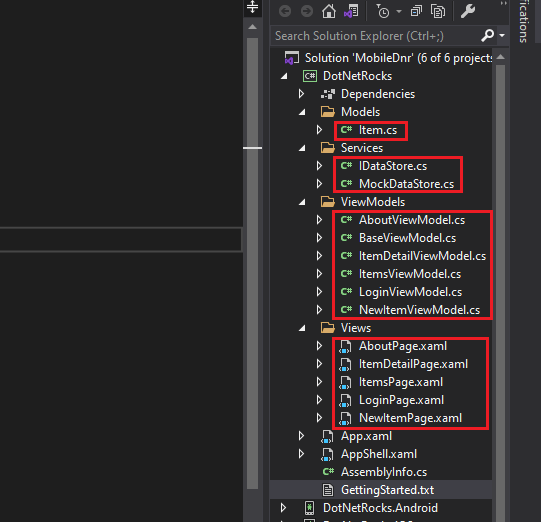
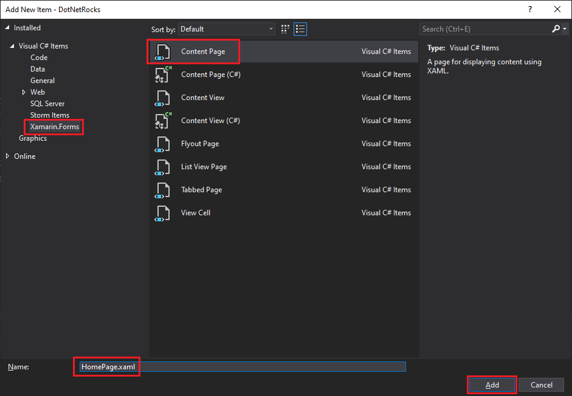
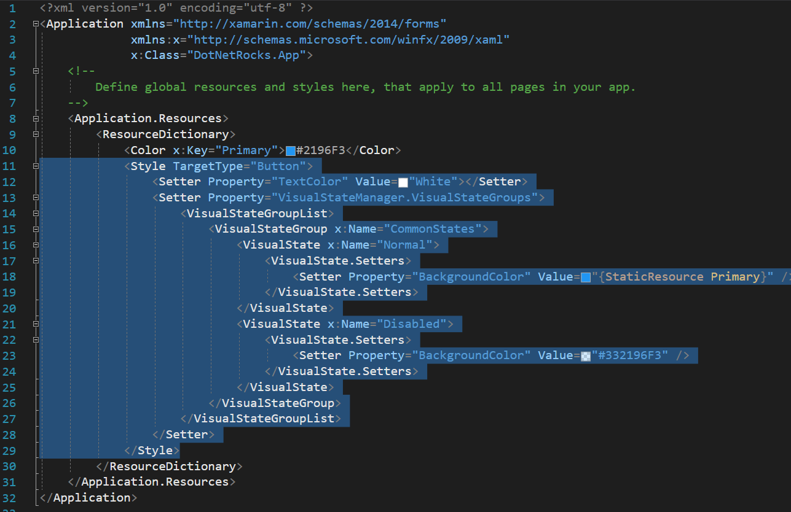
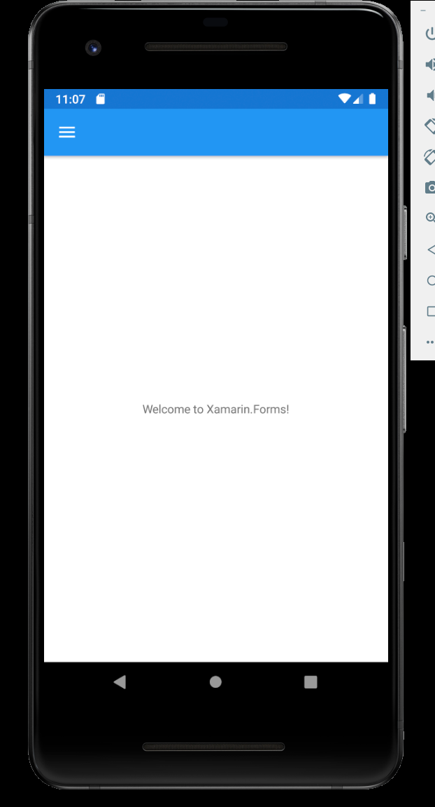
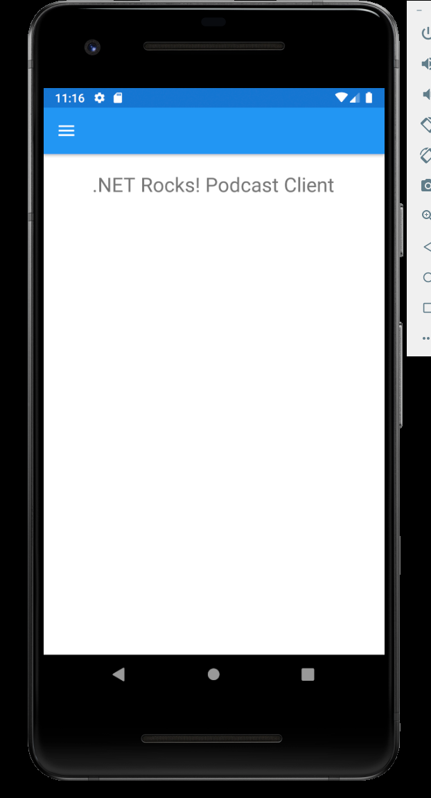
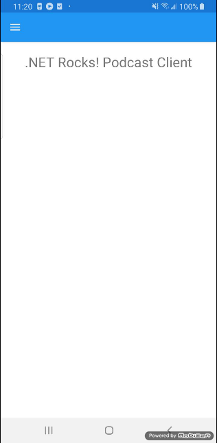
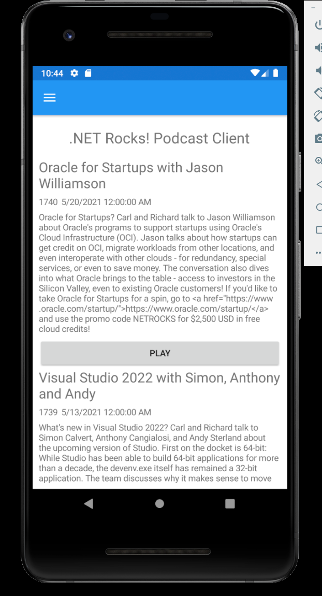
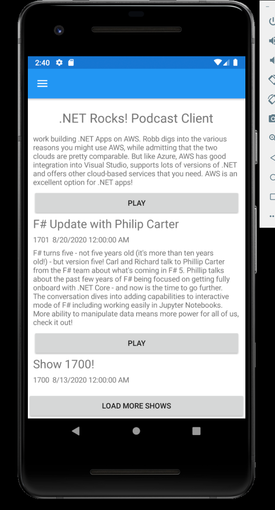

# The .NET Show Episode 4 

###### Building a Mobile Podcast App Part 3

See more projects at https://github.com/carlfranklin/DotNetShow

Watch the video at https://youtu.be/bOiw45wXbrQ

All episodes are listed at https://thedotnetshow.com

## Overview

Starting with episode 2 of The .NET Show, I am building a mobile podcast app for my podcast, .NET Rocks! using Xamarin Forms. 

At this point we have written all the code to show metadata for each episode. We can also download, cache, and play mp3 files with URLs that come from that metadata. 

Now we need to refactor this code into a new project, one that uses a newer **Shell** template, which is recommended by Microsoft for all modern Xamarin Forms projects, and will also help us when it comes time to upgrade to MAUI sometime in the future. 

The Shell template also gives us a slick navigation system, which we will need in order to bring our app to the next level. However, in this document (and episode) we will just focus on getting our app to work as is, and then in the next installment we will start transforming the app into a real podcast client.

### Step 8 - Add a new project to the solution

To the solution, add a new **Mobile App (Xamarin Forms)** application called **DotNetRocks**. 



Make sure you select the **Flyout** option for user interface.



### Step 9 - Delete default template files

The default Shell template comes with sample files that we won't be using. Delete all the files in the `Models`, `Services`, `ViewModels`, and `Views` folders, but leave the folders there.





### Step 10 - Add a Default Content Page

To the *Views* folder, add a new item (Ctrl+Shift+A). Select **Xamarin.Forms** on the left. Select **Content Page** from the list, and name it *HomePage.xaml*. Then Select the **Add** button.



## Step 11 - Clean up unused Xaml and code

#### Delete Styles from App.xaml

Open the App.xaml file and delete the `Button` style



#### Clean up *App.xaml.cs*

Replace *App.xaml.cs* with this: 

```c#
using DotNetRocks.Views;
using System;
using Xamarin.Forms;
using Xamarin.Forms.Xaml;

namespace DotNetRocks
{
    public partial class App : Application
    {
        public App()
        {
            InitializeComponent();
            MainPage = new AppShell();
        }

        protected override void OnStart()
        {
        }

        protected override void OnSleep()
        {
        }

        protected override void OnResume()
        {
        }
    }
}
```

#### Clean up *AppShell.xaml*

Remove everything below the `<Shell.Resources>` section, and replace it with this

```xaml
<FlyoutItem Title="Home" Icon="icon_feed.png">
    <ShellContent Route="Home" ContentTemplate="{DataTemplate local:HomePage}" />
</FlyoutItem>
```

#### Clean up *AppShell.xaml.cs*

The code-behind file for *AppShell.xaml* has a few artifacts that we need to remove. Replace with this:

```c#
using DotNetRocks.Views;
using System;
using System.Collections.Generic;
using Xamarin.Forms;

namespace DotNetRocks
{
    public partial class AppShell : Xamarin.Forms.Shell
    {
        public AppShell()
        {
            InitializeComponent();
        }
    }
}
```

## Set Startup Project and Run the app!

Set **DotNetRocks.Android** as the Startup Project and run.

You should see something like this:



## Hot Reload Test

You can test Hot Reload by editing the *HomePage.xaml* file and saving it. 

Change this:

```
<Label Text="Welcome to Xamarin.Forms!"
```

to this:

```
<Label Text=".NET Rocks! Podcast Client"
```

Right after you hit save, you should see the change:


Experiment with the layout. Change the `<StackLayout>` to this:

```xaml
        <StackLayout Margin="0,20,0,0">
            <Label Text=".NET Rocks! Podcast Client"
                FontSize="Title"
                VerticalOptions="StartAndExpand" 
                HorizontalOptions="CenterAndExpand" />
        </StackLayout>
```



It also works on my Android Phone:



## 

## Step 12 - Add NuGet Packages

Right click the Solution in the Solution Explorer and select **Manage NuGet Packages for Solution...**

Go to the **Installed** tab, an install the following packages into the three **DotNetRocks** projects:

​	`DevExpress.XamarinForms.CollectionView`
​	`MonkeyCache.FileStore`
​	`Plugin.MediaManager.Forms`
​	`Refractored.MvvmHelpers`

#### Add CrossMediaManager support to Android and iOS packages:

*DotNetRocks.Android\MainActivity.cs* :

```c#
protected override void OnCreate(Bundle savedInstanceState)
{
    base.OnCreate(savedInstanceState);
    CrossMediaManager.Current.Init(this);
    Xamarin.Essentials.Platform.Init(this, savedInstanceState);
    global::Xamarin.Forms.Forms.Init(this, savedInstanceState);
    LoadApplication(new App());
}
```

*DotNetRocks.iOS/AppDelegate.cs*:

```c#
public override bool FinishedLaunching(UIApplication app, NSDictionary options)
{
    global::Xamarin.Forms.Forms.Init();
    CrossMediaManager.Current.Init();
    LoadApplication(new App());

    return base.Fi~nishedLaunching(app, options);
}
```


## Step 13 - Copy Xaml and Code from MobileDnr

#### Copy Models

Copy all the model files (*Show.cs*, etc.) from the **MobileDnr** project to the **DotNetRocks** project's *Models* folder and change their namespaces to `DotNetRocks.Models`:

```c#
namespace DotNetRocks.Models
{
	public class File
	{
		public int Id { get; set; }
		public int ShowId { get; set; }
		public string Url { get; set; }
		public int Minutes { get; set; }
		public int Bytes { get; set; }
	}
}
```

```c#
namespace DotNetRocks.Models
{
    public class Guest
    {
        public int Id { get; set; }
        public string Name { get; set; } = "";
        public string PhotoUrl { get; set; } = "";
        public string Bio { get; set; } = "";
        public string LastError { get; set; } = "";
        public string PhotoPath { get; set; } = "";
    }
}
```

```c#
namespace DotNetRocks.Models
{
	public class Link
	{
		public int Id { get; set; }
		public int ShowId { get; set; }
		public string Text { get; set; } = "";
		public string Url { get; set; } = "";
		public string LastError { get; set; } = "";
	}
}
```

```c#
namespace DotNetRocks.Models
{
    public class Show
    {
        public int Id { get; set; }
        public bool Enabled { get; set; }
        public int ShowNumber { get; set; }
        public string ShowTitle { get; set; } = "";
        public string Description { get; set; } = "";
        public DateTime DateRecorded { get; set; } = DateTime.Now;
        public DateTime DatePublished { get; set; } = DateTime.Now;

        public string ShowDateString { get; set; } = "";
        public string DayOfWeek { get; set; } = "";

        public string Notes { get; set; } = "";

        public ShowDetails ShowDetails { get; set; } = new ShowDetails();
        public string ListDisplayString
        {
            get
            {
                return ShowNumber.ToString() + " - " + ((DateTime)DatePublished).ToShortDateString() + " - " + ShowTitle;
            }
        }
    }
}
```

```c#
namespace DotNetRocks.Models
{
    public class ShowDetails
    {
        public ShowDetails()
        {
            Guests = new List<Guest>();
            Links = new List<Link>();
            Sponsors = new List<Sponsor>();
            Tags = new List<Tag>();
            File = new File();
        }

        public List<Guest> Guests { get; set; }
        public List<Sponsor> Sponsors { get; set; }
        public List<Link> Links { get; set; }
        public List<Tag> Tags { get; set; }
        public File File { get; set; }
    }
}
```

```c#
namespace DotNetRocks.Models
{
    public class Sponsor
    {
        public int Id { get; set; }
        public string Name { get; set; } = "";
        public string BannerUrl { get; set; } = "";
        public string Blurb { get; set; } = "";
        public string LandingUrl { get; set; } = "";
        public string Copy { get; set; } = "";
        public string LastError { get; set; } = "";
    }
}
```

```c#
namespace DotNetRocks.Models
{
	public class Tag
	{
		public int Id { get; set; }
		public string Text { get; set; } = "";
		public string LastError { get; set; } = "";
	}
}
```

#### Copy ApiService.cs

Copy *ApiService.cs* from the **MobileDnr** project to the **DotNetRocks** project's *Services* folder and change namespace references from `MobileDnr` to `DotNetRocks`:

*ApiService.cs*:

```c#
using System;
using System.Collections.Generic;
using System.Text;
using Newtonsoft.Json;
using DotNetRocks.Models;
using System.Net.Http;
using System.Threading.Tasks;

namespace DotNetRocks.Services
{
    public class ApiService
    {
        private HttpClient httpClient;
        private string ShowName = "dotnetrocks";
        string baseUrl = "https://pwopclientapi.azurewebsites.net/shows/";

        public ApiService()
        {
            httpClient = new HttpClient() { BaseAddress = new Uri(baseUrl) };
        }

        public async Task<List<Show>> GetAllShows()
        {
            string Url = ShowName;
            var result = await httpClient.GetAsync(Url);
            result.EnsureSuccessStatusCode();
            var response = await result.Content.ReadAsStringAsync();
            return JsonConvert.DeserializeObject<List<Show>>(response);
        }

        public async Task<int> GetCount()
        {
            string Url = $"{ShowName}/getcount";
            var result = await httpClient.GetAsync(Url);
            result.EnsureSuccessStatusCode();
            var response = await result.Content.ReadAsStringAsync();
            return Convert.ToInt32(response);
        }

        public async Task<List<Show>> GetRange(int FirstShowNumber, int LastShowNumber)
        {
            string Url = $"{ShowName}/{FirstShowNumber}/{LastShowNumber}/getrange";
            var result = await httpClient.GetAsync(Url);
            result.EnsureSuccessStatusCode();
            var response = await result.Content.ReadAsStringAsync();
            return JsonConvert.DeserializeObject<List<Show>>(response);
        }

        public async Task<ShowDetails> GetShowDetails(int ShowNumber)
        {
            string Url = $"{ShowName}/{ShowNumber}/getdetails";
            var result = await httpClient.GetAsync(Url);
            result.EnsureSuccessStatusCode();
            var response = await result.Content.ReadAsStringAsync();
            return JsonConvert.DeserializeObject<ShowDetails>(response);
        }
    }
}
```

#### Copy and Rename MainViewModel.cs

Copy *MainViewModel.cs* from the **MobileDnr** project to the **DotNetRocks** project's *ViewModels* folder, and rename it to *HomePageViewModel.cs* in the Solution Explorer. Allow it to change the name of the class as well. Then, change namespace references from `MobileDnr` to `DotNetRocks`:

```c#
using System;
using System.Collections.Generic;
using System.Text;
using System.Runtime.CompilerServices;
using System.ComponentModel;
using MvvmHelpers;
using System.Windows.Input;
using MvvmHelpers.Commands;
using MediaManager;
using System.Threading.Tasks;
using MonkeyCache.FileStore;
using System.IO;
using System.Net;
using Xamarin.Essentials;
using System.Xml;
using DotNetRocks.Services;
using DotNetRocks.Models;
using System.Collections.ObjectModel;

namespace DotNetRocks.ViewModels
{
    public class HomePageViewModel : BaseViewModel
    {
        string CacheDir = "";
        string CachedFileName = "";
        FileStream LocalFileStream = null;
        ApiService ApiService = new ApiService();

        public HomePageViewModel()
        {
            Barrel.ApplicationId = "mobile_dnr";
            CacheDir = FileSystem.CacheDirectory;
            CrossMediaManager.Current.PositionChanged += Current_PositionChanged;
            CrossMediaManager.Current.MediaItemFinished += Current_MediaItemFinished;

            // Does the file exist?
            if (System.IO.File.Exists(CachedFileName))
            {
                // Yes! We are cached
                IsCached = true;
            }
            var t = Task.Run(() => LoadAllShows());
            t.Wait();
        }

        private async Task LoadAllShows()
        {
            AllShows = await ApiService.GetAllShows();
            AllShows[0].ShowDetails = await ApiService.GetShowDetails(AllShows[0].ShowNumber);
            CurrentStatus = $"{AllShows.Count} shows downloaded. First show title: {AllShows[0].ShowTitle}. " +
                $"The first guest is {AllShows[0].ShowDetails.Guests[0].Name} " +
                $"and the file can be downloaded at {AllShows[0].ShowDetails.File.Url}";
        }

        private void Current_PositionChanged(object sender, MediaManager.Playback.PositionChangedEventArgs e)
        {
            TimeSpan currentMediaPosition = CrossMediaManager.Current.Position;
            TimeSpan currentMediaDuration = CrossMediaManager.Current.Duration;
            TimeSpan TimeRemaining = currentMediaDuration.Subtract(currentMediaPosition);
            if (IsPlaying)
                CurrentStatus = $"Time Remaining: {TimeRemaining.Minutes:D2}:{TimeRemaining.Seconds:D2}";
        }

        private void Current_MediaItemFinished(object sender, MediaManager.Media.MediaItemEventArgs e)
        {
            CurrentStatus = "";
            IsPlaying = false;
            if (LocalFileStream != null)
            {
                LocalFileStream.Dispose();
            }
        }

        private bool isPlaying;
        public bool IsPlaying
        {
            get
            {
                return isPlaying;
            }
            set
            {
                SetProperty(ref isPlaying, value);
            }
        }

        private ICommand play;
        public ICommand Play
        {
            get
            {
                if (play == null)
                {
                    play = new AsyncCommand<string>(PerformPlay);
                }

                return play;
            }
        }

        public void DownloadFile(string Url)
        {
            var Uri = new Uri(Url);

            WebClient webClient = new WebClient();
            using (webClient)
            {
                webClient.DownloadDataCompleted += (s, e) =>
                {
                    try
                    {
                        System.IO.File.WriteAllBytes(CachedFileName, e.Result);
                        IsCached = true;
                    }
                    catch (Exception ex)
                    {
                        var msg = ex.Message;
                    }
                };

                webClient.DownloadDataAsync(Uri);
            }
        }

        private async Task PerformPlay(string Url)
        {
            IsPlaying = true;
            string FileNameOnly = Path.GetFileName(Url);
            CachedFileName = Path.Combine(CacheDir, FileNameOnly);

            if (!IsCached)
            {
                // Not in cache. Play from URL
                CurrentStatus = "Downloading...";
                await CrossMediaManager.Current.Play(Url);
                // Download the file to the cache
                DownloadFile(Url);
            }
            else
            {
                // In the cache. Play local file
                CurrentStatus = "Playing from Cache...";
                LocalFileStream = System.IO.File.OpenRead(CachedFileName);
                await CrossMediaManager.Current.Play(LocalFileStream, FileNameOnly);
            }
        }

        private ICommand stop;
        public ICommand Stop
        {
            get
            {
                if (stop == null)
                {
                    stop = new AsyncCommand(PerformStop);
                }
                return stop;
            }
        }

        protected async Task PerformStop()
        {
            IsPlaying = false;
            CurrentStatus = "";
            await CrossMediaManager.Current.Stop();

            if (LocalFileStream != null)
            {
                LocalFileStream.Dispose();
            }
        }

        private string currentStatus;
        public string CurrentStatus { get => currentStatus; 
        	set => SetProperty(ref currentStatus, value); }

        private bool isCached;
        public bool IsCached { get => isCached; 
        	set => SetProperty(ref isCached, value); }

        private List<Show> allShows = new List<Show>();
        public List<Show> AllShows { get => allShows; 
        	set => SetProperty(ref allShows, value); }

    }
}
```

#### Copy InverseBoolConverter.cs 

Copy the *InverseBoolConverter.cs* file from the `MobileDnr` project to the `DotNetRocks` project and change the namespace to `DotNetRocks` :

```c#
using System;
using System.Collections.Generic;
using System.Globalization;
using System.Text;
using Xamarin.Forms;

namespace DotNetRocks
{
    public class InverseBoolConverter : IValueConverter
    {
        public object Convert(object value, Type targetType,
            object parameter, CultureInfo culture)
        {
            return !((bool)value);
        }

        public object ConvertBack(object value, Type targetType,
            object parameter, CultureInfo culture)
        {
            return value;
        }
    }
}
```

#### Modify *HomePage.xaml*

Replace *HomePage.xaml* with the following:

```xaml
<?xml version="1.0" encoding="utf-8" ?>
<ContentPage xmlns="http://xamarin.com/schemas/2014/forms"
             xmlns:x="http://schemas.microsoft.com/winfx/2009/xaml"
             x:Class="DotNetRocks.Views.HomePage"
             xmlns:local="clr-namespace:DotNetRocks"
             xmlns:viewmodels="clr-namespace:DotNetRocks.ViewModels"
             xmlns:dxcv="http://schemas.devexpress.com/xamarin/2014/forms/collectionview"
             >
    
    <ContentPage.BindingContext>
        <viewmodels:HomePageViewModel/>
    </ContentPage.BindingContext>

    <ContentPage.Resources>
        <local:InverseBoolConverter x:Key="InverseBoolConverter"/>
    </ContentPage.Resources>
    
    <ContentPage.Content>
        <StackLayout>
            <Label Margin="0,20,0,0"
                Text=".NET Rocks! Podcast Client"
                FontSize="Title"
                VerticalOptions="StartAndExpand" 
                HorizontalOptions="CenterAndExpand" />
            <Label Margin="10,10,0,0"
               IsVisible="{Binding IsPlaying}" Text="{Binding CurrentStatus}" />
            <dxcv:DXCollectionView x:Name="MyCollectionView" 
                               ItemsSource="{Binding AllShows}">
                <dxcv:DXCollectionView.ItemTemplate>
                    <DataTemplate>
                        <StackLayout>
                            <Label Text="{Binding ShowTitle}" FontSize="Large"/>
                            <StackLayout Orientation="Horizontal">
                                <Label Text="{Binding ShowNumber}" />
                                <Label Text="{Binding DatePublished, StringFormat='Published {d}'}" />
                            </StackLayout>
                            <Label Text="{Binding Description}" />
                            <Button Text="Play"
                            IsVisible="{Binding IsPlaying, 
                                Converter={StaticResource InverseBoolConverter},
                                Source={RelativeSource AncestorType={x:Type viewmodels:HomePageViewModel}}}"
                            Command="{Binding Play, 
                                Source={RelativeSource AncestorType={x:Type viewmodels:HomePageViewModel}}}" 
                            CommandParameter="{Binding ShowDetails.File.Url}" />
                            <Button Text="Stop" 
                            IsVisible="{Binding IsPlaying,
                                Source={RelativeSource AncestorType={x:Type viewmodels:HomePageViewModel}}}" 
                            Command="{Binding Stop,
                                Source={RelativeSource AncestorType={x:Type viewmodels:HomePageViewModel}}}" />
                        </StackLayout>
                    </DataTemplate>
                </dxcv:DXCollectionView.ItemTemplate>
                <dxcv:DXCollectionView.Margin>
                    <OnIdiom x:TypeArguments="Thickness" Phone="10,10,10,10" Tablet="71,0,0,0"/>
                </dxcv:DXCollectionView.Margin>
            </dxcv:DXCollectionView>
        </StackLayout>
    </ContentPage.Content>
</ContentPage>
```

This is what we changed from the **MobileDnr** project:

1. We added a `viewmodels` xml namespace and changed all references to the viewmodel
2. We moved the main `<StackLayout>` into a `<ContentPage.Content>` block
3. We added our **.NET Rocks! Podcast Client** label to the top of the StackLayout.

At this point you should be able to run the app, see the list of shows, and play a show:




## Step 14 - Only list 20 shows at a time

Before we move on, let's modify the app to download the first 20 shows (metadata only), and then display a button to load the next 20. That will significantly reduce the load on the API.

For that we need to keep track of all the show numbers. 

Add to *Models* folder:

*GetByShowNumbersRequest.cs*:

```c#
using System;
using System.Collections.Generic;
using System.Text;

namespace DotNetRocks.Models
{
    public class GetByShowNumbersRequest
    {
        public string ShowName { get; set; }
        public List<int> Indexes { get; set; }
    }
}

```


Add the following methods to *ApiService.cs* :

```c#
public async Task<List<int>> GetShowNumbers()
{
    try
    {
        string Url = $"{ShowName}/getshownumbers";
        var result = await httpClient.GetAsync(Url);
        result.EnsureSuccessStatusCode();
        var response = await result.Content.ReadAsStringAsync();
        return JsonConvert.DeserializeObject<List<int>>(response);
    }
    catch (Exception ex)
    {
        var msg = ex.Message;
        return null;
    }
}

public async Task<List<Show>> GetByShowNumbers(GetByShowNumbersRequest Request)
{
    try
    {
        var http = new HttpClient();
        var url = baseUrl;
        string json = JsonConvert.SerializeObject(Request);
        var content = new StringContent(json, System.Text.Encoding.UTF8,
                                        "application/json");
        var result = await http.PostAsync(url, content);
        result.EnsureSuccessStatusCode();
        string responseBody = await result.Content.ReadAsStringAsync();
        var items = JsonConvert.DeserializeObject<List<Show>>(responseBody);
        return items;
    }
    catch (Exception ex)
    {
        var msg = ex.Message;
        return null;
    }
}
```


Add to *HomePageViewModel.cs*

```c#
public async Task GetNextBatchOfShows()
{
    if (ShowNumbers.Count == 0)
    {
        ShowNumbers = await ApiService.GetShowNumbers();
        if (ShowNumbers == null || ShowNumbers.Count == 0) return;
        LastShowNumber = ShowNumbers.First<int>() + 1;
    }

    var request = new GetByShowNumbersRequest()
    {
        ShowName = "dotnetrocks",
        Indexes = (from x in ShowNumbers 
                   where x < LastShowNumber 
                   && x > (LastShowNumber - RecordsToRead) 
                   select x).ToList()
    };

    var nextBatch = await ApiService.GetByShowNumbers(request);
    if (nextBatch == null || nextBatch.Count == 0) return;

    AllShows.AddRange(nextBatch);
    LastShowNumber = nextBatch.Last<Show>().ShowNumber;
}
```

To *HomePage.xaml*, add the following button at the bottom of the main `<StackLayout>`:

```xaml
<Button Text="Load More Shows"
        Command="{Binding LoadMoreShows}" />
```

Add the following command to *HomePageViewModel.cs* :

```c#
private ICommand loadMoreShows;
public ICommand LoadMoreShows
{
    get
    {
        if (loadMoreShows == null)
        {
            loadMoreShows = new AsyncCommand(GetNextBatchOfShows);
        }
        return loadMoreShows;
    }
}
```

Before we can run, we need to change the `HomePageViewModel` constructor code to call `GetNextBatchOfShows()` instead of `LoadAllShows()`:

```c#
var t = Task.Run(() => GetNextBatchOfShows());
t.Wait();
```

Now, run the app.




Every time you push the `LOAD MORE SHOWS` button, another 20 episodes will be added to the list.

